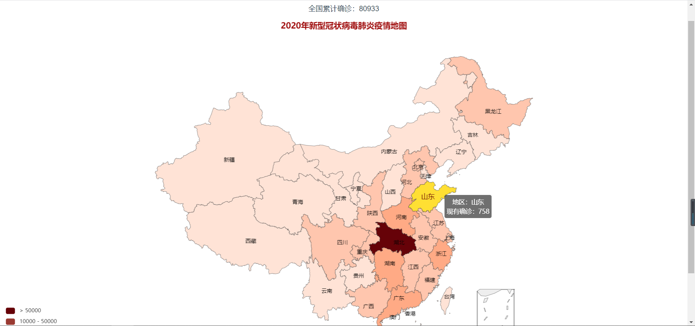
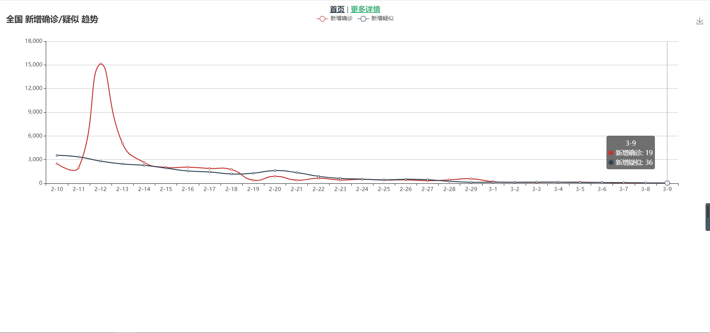

# vue-map
# 图片效果展示1


# 图片效果展示2


<a href="https://nieyangyang712.github.io/">项目展示地址：https://nieyangyang712.github.io/</a>

# 全国地铁效果展示图


<a href="https://nieyangyang712.github.io/">全国地铁线路图：https://nieyangyang712.github.io/china_Subway/</a>


## Project setup
```
npm install
```
### Compiles and hot-reloads for development
```
npm run serve
```

### Compiles and minifies for production
```
npm run build
```

### Customize configuration
See [Configuration Reference](https://cli.vuejs.org/config/).
